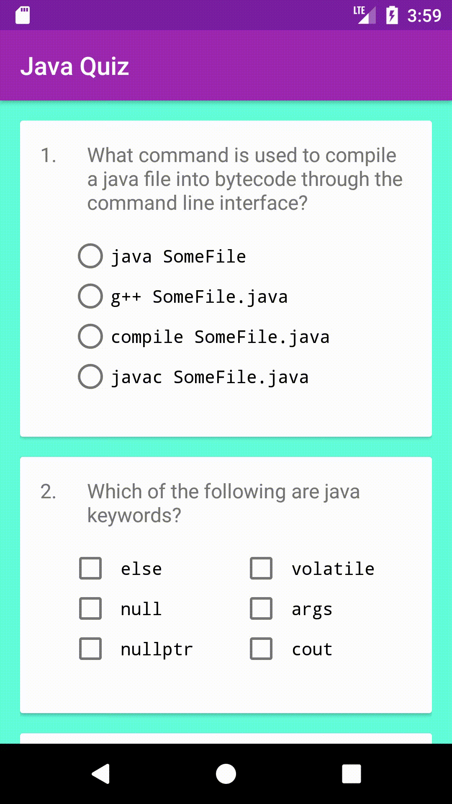

# Udacity-Project-5-Quiz-App
This application test the user's knowledge on basic Java fundamentals

## Requirements

#### Layout
- [x] App contains 4 - 10 questions, including at least one check box, one radio button, and one text entry.
- [x] Questions are in a variety of formats such as free text response, checkboxes, and radio buttons.
     -Checkboxes are only used for questions with multiple right answers. Radio buttons are only used for questions with a single right answer.
- [x] App includes a button for the user to submit their answers and receive a score.
- [x] The app includes at least four of the following Views: TextView, ImageView, Button, Checkbox, EditText, LinearLayout, RelativeLayout, ScrollView, RadioButton, RadioGroup.
     -If applicable, the app uses nested ViewGroups to reduce the complexity of the layout.
- [x] The app gracefully handles displaying all the content on screen when rotated. Either by updating the layout, adding a scrollable feature or some other mechanism that adheres to Android development guidelines.
- [x] The code adheres to all of the following best practices:
     -Text sizes are defined in sp
     -Lengths are defined in dp
     -Padding and margin is used appropriately, such that the views are not crammed up against each other.

#### Functionality
- [x] The code runs without errors
- [x] Each question has a correct answer.
- [x] Any question which uses radio buttons allows only one to be checked at once.
- [x] The app contains at least one if/else statement
- [x] The grading button displays a toast which accurately displays the results of the quiz.
- [x] The grading logic checks each answer correctly. The app accurately calculates the number of correct answers and does not include incorrect answers in the count.
     -Note: When applicable, in the grading logic remember to check that the correct answers are checked AND the incorrect answers are not checked.

 #### Code Readability
- [x] All variables, methods, and resource IDs are descriptively named so that another developer reading the code can easily understand their function.
- [x] The code is properly formatted:
     - No unnecessary blank lines
     - No unused variables or methods
     - No commented out code
- [x] The code also has proper indentation when defining variables and methods.

